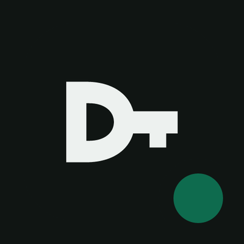

# Devino MCP servers

Hosted remote MCP servers for the Devino Solutions products. Each one is a Streamable HTTP endpoint with OAuth 2.1 sign-in, so there is nothing to install or run: point your MCP client at the URL and sign in when the browser opens.

Every folder is a Cursor plugin (`.cursor-plugin/plugin.json` + `mcp.json` + workflow skills) and carries a README with setup for Cursor, Cline, VS Code, Claude Code and other clients, plus an `llms-install.md` that Cline and other agents follow to install it.

The repository root is also a [Gemini CLI](https://geminicli.com) extension with all servers: `gemini extensions install https://github.com/DevinoSolutions/mcp-servers`, then `/mcp auth <server>` for the products you use.

`agent-plugins/<server>` holds the same servers as Kiro powers in the [Agent Plugins](https://agent-plugins.org) format (`plugin.json` + `mcp.json` + skills).

`copilot-plugins/<server>` holds GitHub Copilot CLI plugins, in the same format, for the servers that fit a coding agent (SnapVisor, Uptimely, upAPI, Notifly, Sendly, doDomain): `copilot plugin install DevinoSolutions/mcp-servers:copilot-plugins/<server>`.

`antigravity-plugins/<server>` holds [Google Antigravity](https://antigravity.google/docs/plugins/) plugins for all servers (`plugin.json` + `mcp_config.json` + skills). See [Antigravity](#antigravity) below.

| | Server | What it does | Endpoint | One-click |
|---|---|---|---|---|
|  | [BioFlow](bioflow) | Edit and publish your link-in-bio page, its links and blocks, and read page analytics and signups from BioFlow. | `https://app.getbioflow.com/api/mcp` | [Cursor](https://cursor.com/install-mcp?name=bioflow&config=eyJ1cmwiOiJodHRwczovL2FwcC5nZXRiaW9mbG93LmNvbS9hcGkvbWNwIn0%3D) · [VS Code](https://insiders.vscode.dev/redirect/mcp/install?name=bioflow&config=%7B%22type%22%3A%22http%22%2C%22url%22%3A%22https%3A%2F%2Fapp.getbioflow.com%2Fapi%2Fmcp%22%7D) |
|  | [Caly](caly) | Find open meeting times, book, reschedule and cancel meetings, and read your event types, bookings and schedules in Caly. | `https://mcp.trycaly.com/mcp` | [Cursor](https://cursor.com/install-mcp?name=caly&config=eyJ1cmwiOiJodHRwczovL21jcC50cnljYWx5LmNvbS9tY3AifQ%3D%3D) · [VS Code](https://insiders.vscode.dev/redirect/mcp/install?name=caly&config=%7B%22type%22%3A%22http%22%2C%22url%22%3A%22https%3A%2F%2Fmcp.trycaly.com%2Fmcp%22%7D) |
|  | [doDomain](dodomain) | Connect customers' custom domains to your product: guided DNS setup, verification and certificates, managed from doDomain. | `https://app.dodomain.io/api/mcp` | [Cursor](https://cursor.com/install-mcp?name=dodomain&config=eyJ1cmwiOiJodHRwczovL2FwcC5kb2RvbWFpbi5pby9hcGkvbWNwIn0%3D) · [VS Code](https://insiders.vscode.dev/redirect/mcp/install?name=dodomain&config=%7B%22type%22%3A%22http%22%2C%22url%22%3A%22https%3A%2F%2Fapp.dodomain.io%2Fapi%2Fmcp%22%7D) |
|  | [GetItDone](getitdone) | Create, update and track tasks and projects across your GetItDone team workspaces. | `https://app.nowgetitdone.com/api/mcp` | [Cursor](https://cursor.com/install-mcp?name=getitdone&config=eyJ1cmwiOiJodHRwczovL2FwcC5ub3dnZXRpdGRvbmUuY29tL2FwaS9tY3AifQ%3D%3D) · [VS Code](https://insiders.vscode.dev/redirect/mcp/install?name=getitdone&config=%7B%22type%22%3A%22http%22%2C%22url%22%3A%22https%3A%2F%2Fapp.nowgetitdone.com%2Fapi%2Fmcp%22%7D) |
|  | [Notifly](notifly) | Manage notification workflows, subscribers and topics, and trigger delivery across email, SMS, push, chat and in-app channels with Notifly. | `https://api.notifly.io/mcp` | [Cursor](https://cursor.com/install-mcp?name=notifly&config=eyJ1cmwiOiJodHRwczovL2FwaS5ub3RpZmx5LmlvL21jcCJ9) · [VS Code](https://insiders.vscode.dev/redirect/mcp/install?name=notifly&config=%7B%22type%22%3A%22http%22%2C%22url%22%3A%22https%3A%2F%2Fapi.notifly.io%2Fmcp%22%7D) |
|  | [Postify](postify) | Draft, schedule and publish social media posts to your connected channels, and read post analytics, from your Postify calendar. | `https://app.usepostify.com/api/mcp` | [Cursor](https://cursor.com/install-mcp?name=postify&config=eyJ1cmwiOiJodHRwczovL2FwcC51c2Vwb3N0aWZ5LmNvbS9hcGkvbWNwIn0%3D) · [VS Code](https://insiders.vscode.dev/redirect/mcp/install?name=postify&config=%7B%22type%22%3A%22http%22%2C%22url%22%3A%22https%3A%2F%2Fapp.usepostify.com%2Fapi%2Fmcp%22%7D) |
|  | [Sendly](sendly) | Send transactional email, run campaigns, and manage contacts, lists and segments in Sendly. | `https://app.sendly.now/api/mcp` | [Cursor](https://cursor.com/install-mcp?name=sendly&config=eyJ1cmwiOiJodHRwczovL2FwcC5zZW5kbHkubm93L2FwaS9tY3AifQ%3D%3D) · [VS Code](https://insiders.vscode.dev/redirect/mcp/install?name=sendly&config=%7B%22type%22%3A%22http%22%2C%22url%22%3A%22https%3A%2F%2Fapp.sendly.now%2Fapi%2Fmcp%22%7D) |
|  | [Shorty](shorty) | Summarize and transcribe videos, audio files, documents and web pages with Shorty. | `https://aishorty.com/api/mcp` | [Cursor](https://cursor.com/install-mcp?name=shorty&config=eyJ1cmwiOiJodHRwczovL2Fpc2hvcnR5LmNvbS9hcGkvbWNwIn0%3D) · [VS Code](https://insiders.vscode.dev/redirect/mcp/install?name=shorty&config=%7B%22type%22%3A%22http%22%2C%22url%22%3A%22https%3A%2F%2Faishorty.com%2Fapi%2Fmcp%22%7D) |
|  | [SnapVisor](snapvisor) | Review visual regression builds, approve or reject screenshot changes, and manage SnapVisor projects. | `https://mcp.snapvisor.io/` | [Cursor](https://cursor.com/install-mcp?name=snapvisor&config=eyJ1cmwiOiJodHRwczovL21jcC5zbmFwdmlzb3IuaW8vIn0%3D) · [VS Code](https://insiders.vscode.dev/redirect/mcp/install?name=snapvisor&config=%7B%22type%22%3A%22http%22%2C%22url%22%3A%22https%3A%2F%2Fmcp.snapvisor.io%2F%22%7D) |
|  | [SuperBooks](superbooks) | Work with your SuperBooks books: transactions and categories, invoices, customers, receipts, time tracking and financial reports. | `https://app.superbooks.io/mcp` | [Cursor](https://cursor.com/install-mcp?name=superbooks&config=eyJ1cmwiOiJodHRwczovL2FwcC5zdXBlcmJvb2tzLmlvL21jcCJ9) · [VS Code](https://insiders.vscode.dev/redirect/mcp/install?name=superbooks&config=%7B%22type%22%3A%22http%22%2C%22url%22%3A%22https%3A%2F%2Fapp.superbooks.io%2Fmcp%22%7D) |
|  | [uNotes](unotes) | Search a library of university course materials (past exams, assignments, lab reports, lecture notes) and your uNotes flashcards and quizzes. | `https://unotes.net/api/mcp` | [Cursor](https://cursor.com/install-mcp?name=unotes&config=eyJ1cmwiOiJodHRwczovL3Vub3Rlcy5uZXQvYXBpL21jcCJ9) · [VS Code](https://insiders.vscode.dev/redirect/mcp/install?name=unotes&config=%7B%22type%22%3A%22http%22%2C%22url%22%3A%22https%3A%2F%2Funotes.net%2Fapi%2Fmcp%22%7D) |
|  | [upAPI](upapi) | Call a catalog of ready-to-use APIs through one upAPI account and key, without signing up for each upstream service. | `https://app.upapi.io/api/mcp` | [Cursor](https://cursor.com/install-mcp?name=upapi&config=eyJ1cmwiOiJodHRwczovL2FwcC51cGFwaS5pby9hcGkvbWNwIn0%3D) · [VS Code](https://insiders.vscode.dev/redirect/mcp/install?name=upapi&config=%7B%22type%22%3A%22http%22%2C%22url%22%3A%22https%3A%2F%2Fapp.upapi.io%2Fapi%2Fmcp%22%7D) |
|  | [Uptimely](uptimely) | Manage uptime monitors, incidents and status pages, and read check results, in Uptimely. | `https://app.getuptimely.com/api/mcp` | [Cursor](https://cursor.com/install-mcp?name=uptimely&config=eyJ1cmwiOiJodHRwczovL2FwcC5nZXR1cHRpbWVseS5jb20vYXBpL21jcCJ9) · [VS Code](https://insiders.vscode.dev/redirect/mcp/install?name=uptimely&config=%7B%22type%22%3A%22http%22%2C%22url%22%3A%22https%3A%2F%2Fapp.getuptimely.com%2Fapi%2Fmcp%22%7D) |
|  | [VoiceLabs](voicelabs) | Generate speech from text in your voices and transcribe audio with VoiceLabs. | `https://app.voicelabs.now/api/mcp` | [Cursor](https://cursor.com/install-mcp?name=voicelabs&config=eyJ1cmwiOiJodHRwczovL2FwcC52b2ljZWxhYnMubm93L2FwaS9tY3AifQ%3D%3D) · [VS Code](https://insiders.vscode.dev/redirect/mcp/install?name=voicelabs&config=%7B%22type%22%3A%22http%22%2C%22url%22%3A%22https%3A%2F%2Fapp.voicelabs.now%2Fapi%2Fmcp%22%7D) |

All of these are also published in the official MCP Registry.

## Antigravity

Each server is packaged as a native [Antigravity](https://antigravity.google) plugin under `antigravity-plugins/<server>`: a `plugin.json` manifest, an `mcp_config.json` that points at the hosted server with `serverUrl`, the same skills as the Agent Plugins, and the logo. OAuth sign-in happens in the browser on first use, so no API key or local process is needed.

Once a server is listed in the Antigravity Marketplace, install it from the official marketplace with the Antigravity CLI or the `/plugin` command in the IDE:

```bash
agy plugin install postify@antigravity-plugins-official
```

Until then, install any server straight from this repository (the CLI accepts a plugin folder inside a GitHub repository):

```bash
agy plugin install https://github.com/DevinoSolutions/mcp-servers/antigravity-plugins/postify
```

Or clone the repository and run `agy plugin install ./antigravity-plugins/<server>`. In the Antigravity IDE, copy `antigravity-plugins/<server>` into `.agents/plugins/<server>` for one workspace or `~/.gemini/config/plugins/<server>` for all of them, then run `agy plugin list` to confirm. Antigravity does not yet support third-party marketplaces, so there is no marketplace manifest to add; this section will change when it does.

## Security

Tokens come from OAuth 2.1 with PKCE and are bound to each server's MCP resource. You pick scopes on each product's consent screen, and a tool you did not grant is never declared to the assistant. Destructive operations need a setting that only a signed-in person can turn on, plus a confirmation on every call. Report security issues to security@devino.ca.

## About

Maintained by [Devino Solutions](https://devino.ca) (14930398 Canada Inc.). Contact: hello@devino.ca. MIT licensed.
