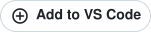
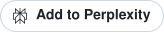

# "Add to <agent>" badges

A button kit every Devino product site can embed so a visitor can add that product's MCP server to their assistant in one click. One SVG per agent, a dark and a light variant, plus [`install-links.json`](../install-links.json) at the repository root with the ready-made link or command for every server and agent.

Each badge shows the agent's official mark next to "Add to <agent>". The marks are copied unchanged from the brand's own published files (or the CC0 [simple-icons](https://simpleicons.org) set where the brand has no single-colour file), kept in [`scripts/badge-marks/`](../scripts/badge-marks), and every badge carries a comment naming its source. Single-colour marks take the badge text colour; VS Code and Kiro keep their own colours because they are only published in colour, and Grok and Antigravity use the dark or white file the brand provides for each background. ChatGPT and Codex keep a generic plus-in-circle glyph: [OpenAI's brand guidelines](https://openai.com/brand/) say not to use its logos without permission, and permission requests go to partnercomms@openai.com.

| Agent | Mark source (fetched 2026-10-10) |
|---|---|
| Claude | simple-icons 16.34.0 `claude` (CC0) |
| Cursor | simple-icons 16.34.0 `cursor` (CC0) |
| VS Code | Microsoft, [code.visualstudio.com/brand](https://code.visualstudio.com/brand) icon pack, `vscode.svg` |
| Kiro | [kiro.dev/icon.svg](https://kiro.dev/icon.svg) |
| Replit | simple-icons 16.34.0 `replit` (CC0) |
| Antigravity | Google, [antigravity.google/press](https://antigravity.google/press) one-color and white icons |
| Gemini | simple-icons 16.34.0 `googlegemini` (CC0) |
| Perplexity | simple-icons 16.34.0 `perplexity` (CC0) |
| Mistral | simple-icons 16.34.0 `mistralai` (CC0) |
| Grok | xAI, [x.ai/legal/brand-guidelines](https://x.ai/legal/brand-guidelines) logo pack, `Grok_Logomark_Dark` / `_Light` |
| ChatGPT, Codex | none (generic glyph until OpenAI grants permission) |

The marks are trademarks of their owners. Use a badge only to link to that agent's install flow or your own setup instructions for it, and follow the owner's guidelines (for example [VS Code](https://code.visualstudio.com/brand) and [xAI](https://x.ai/legal/brand-guidelines)).

| Agent | Dark | Light |
|---|---|---|
| Claude |  |  |
| ChatGPT |  |  |
| Cursor |  |  |
| VS Code |  |  |
| Kiro |  |  |
| Replit |  |  |
| Antigravity |  |  |
| Gemini |  |  |
| Codex |  |  |
| Perplexity |  |  |
| Mistral |  |  |
| Grok |  |  |

Each badge is a 32px-tall pill, under 3 KB (VS Code about 5 KB), with no external fonts (system sans-serif). Dark: `#1f2328` background, white text. Light: white background, `#1f2328` text, 1px `#d0d7de` border.

## Badge URLs

Serve them from jsDelivr (cached CDN, correct `image/svg+xml` type, works in `` tags on any site):

```
https://cdn.jsdelivr.net/gh/DevinoSolutions/mcp-servers@main/badges/add-to-cursor.svg
https://cdn.jsdelivr.net/gh/DevinoSolutions/mcp-servers@main/badges/add-to-cursor-light.svg
```

Or straight from GitHub:

```
https://raw.githubusercontent.com/DevinoSolutions/mcp-servers/main/badges/add-to-cursor.svg
```

Replace `cursor` with any agent slug: `claude`, `chatgpt`, `cursor`, `vscode`, `kiro`, `replit`, `antigravity`, `gemini`, `codex`, `perplexity`, `mistral`, `grok`.

## What each badge links to

Pick the target from `install-links.json` (`servers[].links`). The rule, by agent type:

| Agent type | Agents | Badge target | `install-links.json` key |
|---|---|---|---|
| Deep link (one click installs) | Cursor, VS Code, Kiro, Replit | The agent's install URL | `cursor`, `vscode`, `kiro`, `replit` (the `cursorDeeplink` / `vscodeDeeplink` `cursor:` and `vscode:` schemes work when the app is installed; prefer the https links on a public site) |
| Directory (the agent hosts a listing) | Claude, ChatGPT | The listing page | `claudeDirectory.url` (slug not yet verified, see `verified`), `chatgpt` (null until the plugins directory URL exists) |
| Command only (no deep link) | Antigravity, Gemini CLI, Claude Code, Codex, Perplexity, Mistral, Grok | The app's own docs page, at an anchor that shows a copyable command or the MCP URL | `antigravityCommand`, `geminiCliCommand`, `claudeCodeCommand`, `codexToml`, `manualUrl` |

For command-only agents the badge should open `<your docs>#<agent>` (for example `https://getbioflow.com/mcp#codex`) where the page shows the snippet from `install-links.json` with a copy button. Perplexity, Mistral and Grok take a remote MCP URL in their connector settings, so their anchor shows `manualUrl`. Do not hide a command behind a badge that looks like a one-click install.

## Markdown

```markdown
[](https://cursor.com/install-mcp?name=bioflow&config=eyJ1cmwiOiJodHRwczovL2FwcC5nZXRiaW9mbG93LmNvbS9hcGkvbWNwIn0%3D)
[](https://insiders.vscode.dev/redirect/mcp/install?name=bioflow&config=%7B%22type%22%3A%22http%22%2C%22url%22%3A%22https%3A%2F%2Fapp.getbioflow.com%2Fapi%2Fmcp%22%7D)
```

## HTML

```html
<a href="https://cursor.com/install-mcp?name=bioflow&amp;config=eyJ1cmwiOiJodHRwczovL2FwcC5nZXRiaW9mbG93LmNvbS9hcGkvbWNwIn0%3D" rel="noopener">
  
</a>
```

Use `<picture>` to switch variants with the page theme:

```html
<picture>
  <source srcset="https://cdn.jsdelivr.net/gh/DevinoSolutions/mcp-servers@main/badges/add-to-cursor.svg" media="(prefers-color-scheme: dark)">
  
</picture>
```

## Sample button row (BioFlow)

All links below come from the `bioflow` entry in `install-links.json`.

```html
<div class="mcp-buttons" style="display:flex;flex-wrap:wrap;gap:8px">
  <!-- deep links -->
  <a href="https://cursor.com/install-mcp?name=bioflow&amp;config=eyJ1cmwiOiJodHRwczovL2FwcC5nZXRiaW9mbG93LmNvbS9hcGkvbWNwIn0%3D" rel="noopener"></a>
  <a href="https://insiders.vscode.dev/redirect/mcp/install?name=bioflow&amp;config=%7B%22type%22%3A%22http%22%2C%22url%22%3A%22https%3A%2F%2Fapp.getbioflow.com%2Fapi%2Fmcp%22%7D" rel="noopener"></a>
  <a href="https://kiro.dev/launch/mcp/add?name=bioflow&amp;config=%7B%22url%22%3A%22https%3A%2F%2Fapp.getbioflow.com%2Fapi%2Fmcp%22%2C%22disabled%22%3Afalse%2C%22autoApprove%22%3A%5B%5D%7D" rel="noopener"></a>
  <a href="https://replit.com/integrations?mcp=eyJkaXNwbGF5TmFtZSI6IkJpb0Zsb3ciLCJiYXNlVXJsIjoiaHR0cHM6Ly9hcHAuZ2V0YmlvZmxvdy5jb20vYXBpL21jcCJ9" rel="noopener"></a>
  <!-- directory listings -->
  <a href="https://claude.ai/directory/bioflow" rel="noopener"></a>
  <!-- ChatGPT: add once install-links.json has the plugins-directory URL -->
  <!-- command-only agents: anchors on the app's docs page that show the copyable command -->
  <a href="https://getbioflow.com/mcp#antigravity"></a>
  <a href="https://getbioflow.com/mcp#gemini"></a>
  <a href="https://getbioflow.com/mcp#codex"></a>
  <a href="https://getbioflow.com/mcp#perplexity"></a>
  <a href="https://getbioflow.com/mcp#mistral"></a>
  <a href="https://getbioflow.com/mcp#grok"></a>
</div>
```

The docs anchors then show the matching snippet, for example under `#codex`:

```toml
[mcp_servers.bioflow]
url = "https://app.getbioflow.com/api/mcp"
```

and under `#gemini`:

```bash
gemini extensions install https://github.com/DevinoSolutions/mcp-servers
```

## Loading links at runtime

A site can fetch the registry instead of copying links by hand:

```js
const { servers } = await fetch("https://cdn.jsdelivr.net/gh/DevinoSolutions/mcp-servers@main/install-links.json").then(r => r.json());
const bioflow = servers.find(s => s.name === "bioflow");
document.querySelector("#add-to-cursor").href = bioflow.links.cursor;
```

## Adding an agent

1. Add `("slug", "Label")` to `AGENTS` in [`scripts/gen_badges.py`](../scripts/gen_badges.py). If the agent's owner publishes an official mark, save the file unchanged as `scripts/badge-marks/<slug>.svg` (plus `<slug>-white.svg` for a dark-background variant) and add its source to `MARKS`. Run the script (dark + light SVG land here).
2. Add the agent's link or command key to the `links` object in `install-links.json` (add it in [`scripts/gen_install_links.py`](../scripts/gen_install_links.py) and run it so all 14 servers get it).
3. Add a row to the tables above.
